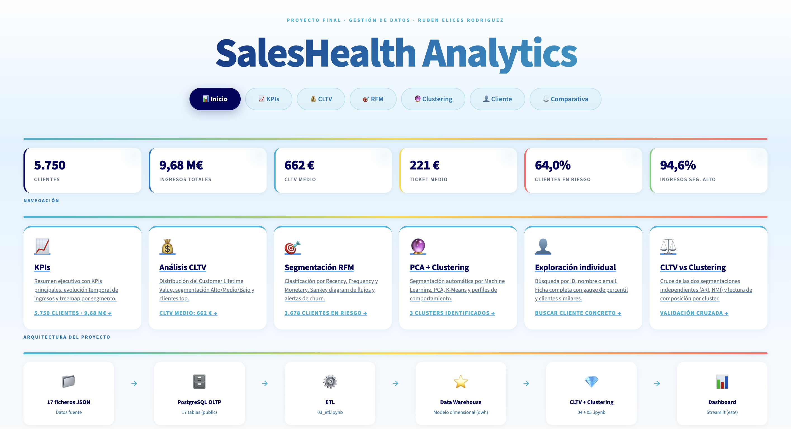

# SalesHealth Analytics

Proyecto final de **Gestión de Datos** centrado en la construcción de un entorno analítico completo sobre una empresa ficticia de productos de salud: desde datos fuente en JSON y un modelo OLTP en PostgreSQL hasta un **Data Warehouse**, métricas de cliente (**CLTV**), segmentación **RFM**, **PCA + clustering** y un **dashboard interactivo en Streamlit**.

## Qué hace el proyecto

- Modela y documenta la base de datos operacional de ventas.
- Diseña un **esquema estrella** para análisis.
- Implementa un proceso **ETL OLTP -> DWH**.
- Calcula el **CLTV** por cliente y lo segmenta por valor.
- Genera segmentación **RFM** y perfiles de negocio.
- Aplica **PCA + K-Means** para descubrir segmentos automáticos.
- Expone los resultados en un **dashboard** navegable.

## Dataset y contexto

- **17 archivos JSON** como fuente original.
- **PostgreSQL OLTP** con 17 tablas en `public`.
- **Data Warehouse** en esquema `dwh`.
- **5.750 clientes**
- **42.555 líneas de venta**
- **20 tiendas**
- **50 productos**
- **Periodo analizado:** 2020-01-01 a 2025-12-30
- **Ingresos totales:** 9.678.678,67 €

## Arquitectura

```text
JSON fuente
   ->
PostgreSQL OLTP
   ->
ETL
   ->
Data Warehouse
   ->
CLTV + RFM + Clustering
   ->
Dashboard Streamlit
```

## Estructura del repositorio

```text
.
├── JSON/                         # Datos fuente originales
├── 01_eda.ipynb                  # Exploración y calidad de datos
├── 02_ddl_dwh.sql                # DDL del Data Warehouse
├── 03_etl.ipynb                  # ETL OLTP -> DWH
├── 04_cltv.ipynb                 # Cálculo y análisis de CLTV
├── 04b_features_diversidad.ipynb # Features adicionales para segmentación
├── 05_pca_clustering.ipynb       # PCA + K-Means
├── 07_dashboard.py               # Dashboard principal en Streamlit
├── pages/                        # Páginas del dashboard
├── utils/                        # Carga de datos, estilos, fórmulas y gráficos
├── cltv_resultados.csv           # Output de la fase CLTV
├── clustering_resultados.csv     # Output de la fase clustering
├── saleshealth_dwh_schema.dbml   # Modelo dimensional
└── requirements.txt              # Dependencias Python
```

## Fases del trabajo

### 1. EDA y calidad de datos

En `01_eda.ipynb` se inspeccionan las 17 tablas del sistema OLTP, se detectan problemas de calidad y se documentan decisiones de imputación y transformación.

Hallazgos relevantes:

- clientes con nulos en email, nombre o teléfono
- discrepancias puntuales entre ventas y líneas de venta
- un producto sin coste conocido
- `offer_id` nulo en prácticamente todas las ventas
- devoluciones y motivos de devolución integrables a nivel de línea

### 2. Diseño del Data Warehouse

El DWH se construye con un **modelo estrella**:

- `fact_sales`
- `dim_date`
- `dim_customer`
- `dim_product`
- `dim_store`
- `dim_offer`
- `dim_return_reason`

La granularidad de `fact_sales` es **una fila por línea de venta**.

### 3. ETL

En `03_etl.ipynb` se implementa la carga al DWH:

- extracción desde OLTP
- limpieza e imputación
- enriquecimiento de dimensiones
- cálculo de métricas de venta y margen
- validaciones de integridad y consistencia
- carga final en el esquema `dwh`

### 4. CLTV y segmentación de valor

En `04_cltv.ipynb` se calcula el valor de cliente a partir del histórico consolidado del DWH.

Definición usada en la versión actual del proyecto:

- **CLTV = Ingresos_t × Margen_t × Frecuencia_t × R_t**

Además se calculan:

- ingresos por cliente
- margen total y margen ratio
- frecuencia de compra
- ticket medio
- días sin compra
- churn proxy
- segmentos `Alto / Medio / Bajo`

### 5. Segmentación RFM

Sobre las variables de comportamiento se construye una segmentación **RFM** orientada a CRM.

Segmentos principales:

- Champions
- Leales
- Potenciales
- Necesitan atencion
- En riesgo
- Perdidos

### 6. PCA + clustering

En `05_pca_clustering.ipynb` se reduce dimensionalidad y se segmentan clientes mediante **K-Means**.

La versión actual del notebook:

- evita colapsar el espacio por clipping agresivo
- preserva variables de negocio relevantes
- exporta coordenadas `pc1`, `pc2` y etiquetas de cluster

Clusters obtenidos en los resultados actuales:

- `VIP`
- `Regular`
- `Bajo valor`

### 7. Dashboard

El dashboard en Streamlit permite navegar por:

- **Inicio / KPIs**
- **CLTV**
- **RFM**
- **Clustering**
- **Cliente**

Incluye:

- indicadores ejecutivos
- distribución y segmentación de valor
- visuales RFM
- espacio PCA y perfiles de cluster
- ficha individual de cliente

## Tecnologías usadas

- **PostgreSQL**
- **Python**
- **pandas**
- **NumPy**
- **SQLAlchemy**
- **scikit-learn**
- **matplotlib / seaborn**
- **Streamlit**
- **Plotly**

## Cómo ejecutar el proyecto

### 1. Instalar dependencias

```bash
pip install -r requirements.txt
```

### 2. Ejecutar el pipeline analítico

Orden recomendado:

1. `01_eda.ipynb`
2. `03_etl.ipynb`
3. `04_cltv.ipynb`
4. `04b_features_diversidad.ipynb` (si se quieren features adicionales)
5. `05_pca_clustering.ipynb`

### 3. Lanzar el dashboard

```bash
streamlit run 07_dashboard.py
```

## Resultados destacados

- base de clientes segmentada por valor, recencia y comportamiento
- CLTV operativo listo para análisis CRM
- segmentación automática interpretable en clusters de negocio
- dashboard final con exploración ejecutiva y analítica

## Notas

- El proyecto prioriza **no eliminar clientes**: los problemas de calidad se resuelven mediante imputación o transformación.
- Algunas salidas CSV están versionadas porque forman parte del flujo analítico y del dashboard actual.
- El dashboard y los notebooks han sido alineados para reflejar las últimas correcciones metodológicas del ETL, CLTV y clustering.

## Autor

**Rubén Elices Rodríguez**  
Proyecto Final · Gestión de Datos · 3º Ingeniería Matemática
